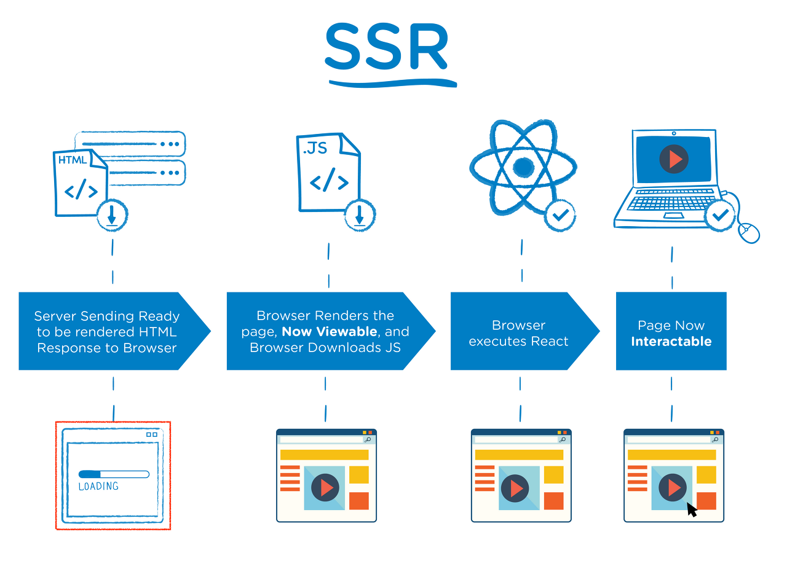
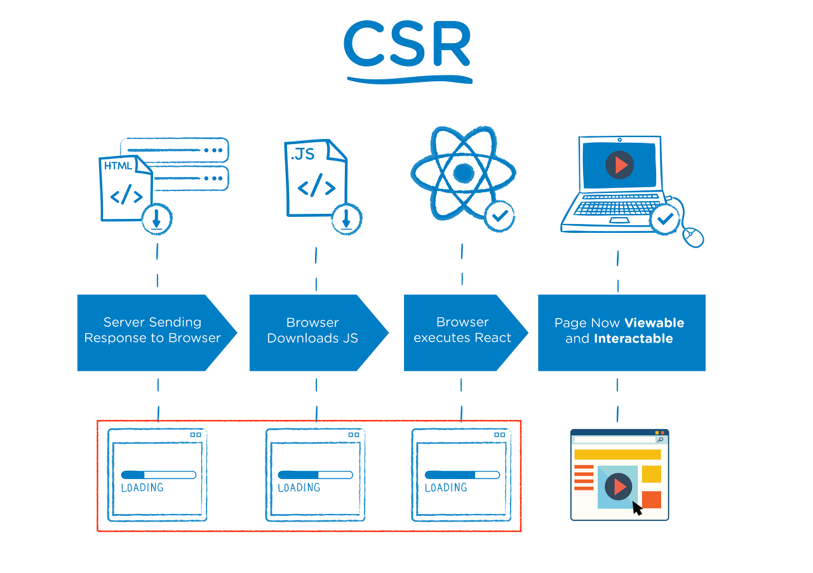

# SSR (Server Side Rendering)
- 서버쪽에서 렌더링 준비를 끝마친 상태로 클라이언트에 전달하는 방식

## SSR 과정
1. 클라이언트가 서버로 요청을 보냄
2. 서버는 렌더링 가능한 html파일을 만듦
3. 클라이언트에 전달되는 순간, HTML은 즉시 렌더링 됨. 그러나 사이트 자체는 조작 불가능
4. 클라이언트가 자바스크립트를 다운받음
5. 다운 받아지고 있는 사이에 유저는 컨텐츠는 볼 수 있지만 사이트를 조작 할 수는 없음. 이때의 사용자 조작을 기억
6. 브라우저가 Javascript 프레임워크를 실행
7. 사용자 조작이 실행 / 웹 페이지 상호작용 가능

## CSR (Client Side Rendering)
- 렌더링이 클라이언트 쪽에서 일어남. 즉, 서버는 요청을 받으면 클라이언트에 HTML과 JS를 보내줌. 클라이언트는 그것을 받아 렌더링을 시작.

## CSR 과정
1. User가 Website 요청을 보냄
2. 클라이언트는 HTML과 JS를 다운로드
3. 다운이 완료된 JS가 실행 => 데이터를 위한 API가 호출
4. 서버가 API로부터의 요청에 응답
5. API로부터 받아온 data를 패치 => 페이지 상호작용이 가능

## SSR과 CSR 차이
### SSR
- 네트워크가 느릴 때 사용하는 것이 좋음 (CSR은 한번에 모든 것을 불러오지만 SSR은 각 페이지마다 나눠불러오기 때문)
- SEO(serach engine optimization : 검색 엔진 최적화)가 필요할 때.
- 최초 로딩이 빠름
- 상호작용이 별로 없음

### CSR
- 네트워크가 빠를 때 사용하는 것이 좋음
- 최초 로딩이 SSR보다 느림
- 사용자와 상호작용이 많음

#### SSG & SSR
- SSG : HTML을 빌드 타임에 각 페이지별로 생성하고 해당 페이지로 요청이 올 경우 이미 생성된 HTML 문서를 반환
- SSR : 요청이 올 때 마다 해당하는 HTML 문서를 그때 그때 생성하여 반환
